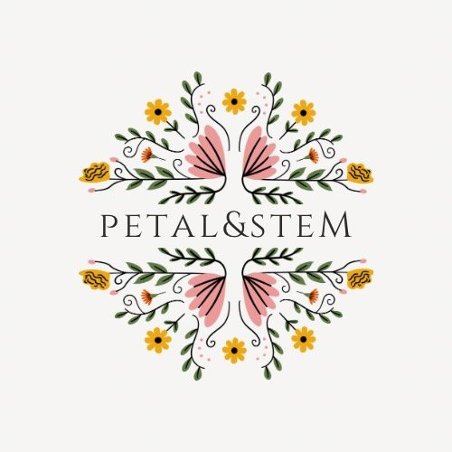

#  Petal & Stem

> *"Flowers that never fade."*

A modern ecommerce platform for premium artificial flowers, offering a seamless shopping experience with cash on delivery payment options.

---

## 🌸 About

**Petal & Stem** is an ecommerce application designed for browsing and purchasing high-quality artificial flowers. With a focus on user experience and convenience, customers can shop beautiful floral arrangements and pay securely upon delivery.

---

## ✨ Features

### 🛍️ Shopping Experience
- **Wide Product Selection** - Browse a diverse catalog of artificial flowers and arrangements

### 🛒 Cart & Checkout
- **Easy Cart Management** - Add, remove, and update quantities seamlessly
- **Cash on Delivery** - No credit card required - pay when you receive your order

### 👤 User Features
- **Secure Authentication** - JWT-based login and registration
- **Newsletter Subscription** - Stay updated with special offers and new arrivals

### 🔐 Security
- **Password Encryption** - Secure user data protection
- **JWT Authentication** - Token-based session management
- **Privacy Protection** - Compliant with data protection standards

---

## 🏗️ Tech Stack

### Frontend
- **React** - Modern UI library for building interactive interfaces
- **React Router** - Client-side routing
- **CSS3** - Custom styling with modern design patterns

### Backend
- **Node.js** - JavaScript runtime environment
- **Express.js** - Fast, minimalist web framework
- **MongoDB** - NoSQL database for flexible data storage
- **Mongoose** - MongoDB object modeling

### Authentication & Security
- **JWT (JSON Web Tokens)** - Secure authentication
- **bcrypt** - Password hashing
- **CORS** - Cross-Origin Resource Sharing enabled

---

## 📄 License

This project is Closed source.

---

## 📞 Contact

**Developer**
- Website: [alasker.dev](https://alasker.dev)
- Company: Alasker Technologies

---
> 

Made by <a href="https://alasker.dev">Alasker Technologies</a>

🌸 Flowers that never fade 🌸

